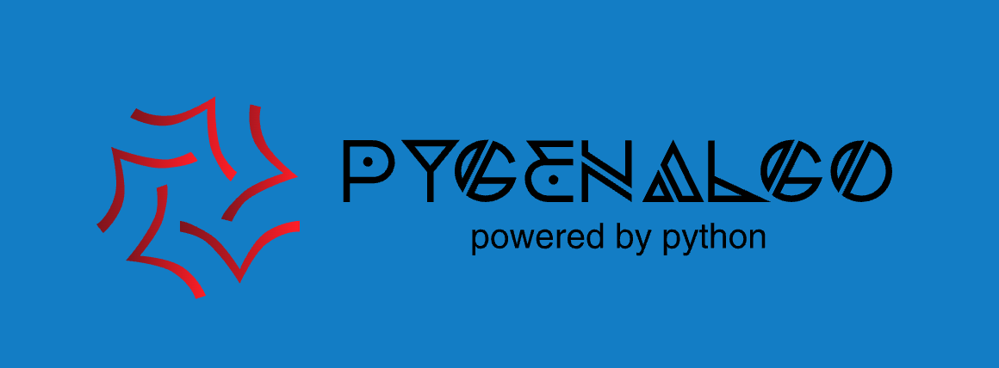

.. PyGenAlgo documentation master file, created by
   sphinx-quickstart on Tue Oct 22 10:40:42 2024.
   You can adapt this file completely to your liking, but it should at least
   contain the root `toctree` directive.

Welcome to PyGenAlgo's documentation!
=====================================
PyGenAlgo is a research toolkit for genetic algorithms. Using a fully
object-oriented paradigm it provides a set of classes that can be used
to solve general purpose optimization problems (constrained and unconstrained).

* **Free software:** GNU GPL Version 3
* **Github repository:** https://github.com/vrettasm/pygeneticalgorithms
* **Python version(s):** 3.10+
* **Python dependencies:** NumPy, JobLib

.. toctree::
   :maxdepth: 1
   :caption: Contents:

   modules
   examples

Indices and tables
==================

* :ref:`genindex`
* :ref:`modindex`
* :ref:`search`
