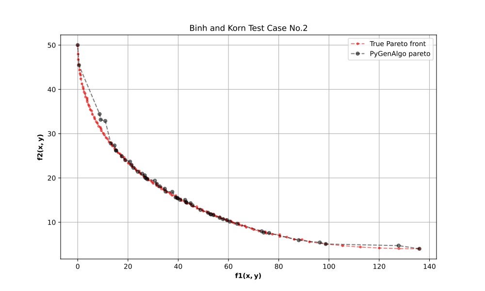

Binh and Korn multiobjective function
=====================================

Description:

    - Optimization   (min)
    - Multiobjective (yes)
    - Constraints    (two)

    The goal is to *minimize* the following equations:

    .. math::
        f_{1}\left(x,y\right) = 4x^{2} + 4y^{2}\\
        f_{2}\left(x,y\right) = \left(x - 5\right)^{2} + \left(y - 5\right)^{2}

    subject to constraints:

    .. math::
        c_{1}\left(x,y\right) = \left(x - 5\right)^{2} + y^{2} \leq 25\\
        c_{2}\left(x,y\right) = \left(x - 8\right)^{2} + \left(y + 3\right)^{2} \geq 7.7

    where:

    .. math::
        0\le x \le 5\\
        0\le y \le 3

    The Pareto-optimal solutions are constituted by solutions:

    .. math::
        x=y \in [0.0, 3.0] \text{  and  } x \in [3.0, 5.0], y=3.0.

Step 1: Import python libraries and PyGenAlgo classes
-----------------------------------------------------

.. code-block:: python

    import numpy as np
    from matplotlib import pyplot as plt

    # Enable LaTex in plotting.
    plt.rcParams["text.usetex"] = True

    # Import main classes.
    from pygenalgo.genome.gene import Gene
    from pygenalgo.genome.chromosome import Chromosome
    from pygenalgo.engines.multi_objective_ga import MultiObjectiveGA
    from pygenalgo.utils.utilities import cost_function, np_pareto_front

    # Import Crossover Operator(s).
    from pygenalgo.operators.crossover.blend_crossover import BlendCrossover

    # Import Mutation Operator(s).
    from pygenalgo.operators.mutation.random_mutator import RandomMutator

    # Import Selection Operator(s).
    from pygenalgo.operators.selection.pareto_front_selector import ParetoFrontSelector

Step 2: Define the objective function
-------------------------------------

.. code-block:: python

    # Set up the multiobjective function.
    @cost_function(minimize=True)
    def fun_test_moo(individual: Chromosome):
        # Extract the x, y values.
        x, y = individual.values()

        # Compute each objective function.
        f1: float = 4.0 * (x**2 + y**2)
        f2: float = (x - 5.0)**2 + (y - 5.0)**2

        # Compute the constraints.
        c1: float = max(0.0, (x - 5.0)**2 + y*y - 25.0)**2         # <= 0.0
        c2: float = min(0.0, (x - 8.0)**2 + (y + 3.0)**2 - 7.7)**2 # >= 0.0

        # Compute the penalty.
        penalty: float = c1 + c2

        return (penalty, f1, f2), False

Step 3: Set the GA parameters
-----------------------------

.. code-block:: python

    # Random number generator.
    rng = np.random.default_rng(1821)

    # Random function that enforce the boundaries in x/y.
    boundary_x = lambda: rng.uniform(0.0, 5.0)
    boundary_y = lambda: rng.uniform(0.0, 3.0)

    # Define the number of chromosomes.
    n_pop = 100

    # Initial population.
    population = [Chromosome([Gene(boundary_x(), boundary_x),
                              Gene(boundary_y(), boundary_y)], None, True)
                  for i in range(n_pop)]

    # Create the MultiObjectiveGA object that will carry on the optimization.
    test_GA = MultiObjectiveGA(initial_pop=population,
                               fit_func=fun_test_moo,
                               select_op=ParetoFrontSelector(),
                               mutate_op=RandomMutator(),
                               crossx_op=BlendCrossover(lower_lim=[0.0, 0.0],
                                                        upper_lim=[5.0, 3.0]))

Step 4: Run the optimization
----------------------------

.. code-block:: python

    test_GA(epochs=250, elitism=True, verbose=False)

Step 5: Compute the true Pareto front
-------------------------------------

.. code-block:: python

    # A list that will hold points that satisfy both constraints.
    points = []

    # Generate a 2D grid sample on:
    # S = [0.0, 5.0] x [0.0, 3.0].
    for x in np.linspace(0.0, 5.0, 25):

        for y in np.linspace(0.0, 3.0, 25):

            # Compute the constraints.
            c1: bool = (x - 5.0)**2 + y**2 - 25.0 <= 0.0
            c2: bool = (x - 8.0)**2 + (y + 3.0)**2 - 7.7 >= 0.0

            # If both constraints are satisfied.
            if c1 and c2:

                # Evaluate both functions.
                f1 = 4.0 * (x**2 + y**2)
                f2 = (x - 5.0)**2 + (y - 5.0)**2

                # Keep the point in the list.
                points.append((f1, f2))

    # Convert lists to numpy.
    points = np.array(points)

    # Estimate the pareto front points.
    true_pareto = np_pareto_front(points, "min")

Step 6: Compute the PyGenAlgo Pareto front
------------------------------------------

.. code-block:: python

    # PyGenAlgo points.
    best_n = []

    for p in test_GA.population:
        # Extract the values.
        x, y = p.values()

        # Compute the constraints.
        c1: bool = (x - 5.0)**2 + y**2 - 25.0 <= 0.0
        c2: bool = (x - 8.0)**2 + (y + 3.0)**2 - 7.7 >= 0.0

        # If both constraints are satisfied.
        if c1 and c2:
            # Evaluate both functions.
            f1 = 4.0 * (x**2 + y**2)
            f2 = (x - 5.0)**2 + (y - 5.0)**2

            # Add them to the list.
            best_n.append((f1, f2))

    # Convert lists to numpy.
    best_n = np.array(best_n)

    # Estimate the pareto front points.
    pareto_best_n = np_pareto_front(best_n, "min")

Step 7: Visualize the solutions
-------------------------------

.. code-block:: python

    # Create a new figure.
    plt.figure(figsize=(10, 6))

    # Plot the Pareto front.
    plt.plot(true_pareto[:, 0],
             true_pareto[:, 1],
             'r.--', alpha=0.5, label="True Pareto front")

    # Plot the Pareto best_n.
    plt.plot(pareto_best_n[:, 0],
             pareto_best_n[:, 1], "ko--", alpha=0.5,
             markersize=5, label="PyGenAlgo pareto")

    # Tidy up the plot.
    plt.title("Binh and Korn Test Case No.2")
    plt.xlabel(r"$\mathbf{f1(x,y)}$")
    plt.ylabel(r"$\mathbf{f2(x,y)}$")
    plt.legend()
    plt.grid(True)

